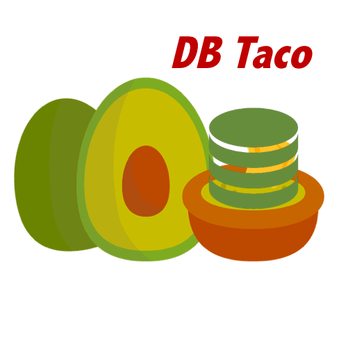

# DB-Taco 
### Juan E. Rolon, 2017


## Overview

Python wrapper for the Sqlite 3 database management system. Provides methods for database intialization, table creation, row and column insertions, cell updating and index specification.

## Description

- **create_database.py**  
Contains the main class and unit test on the creation of a sqlite database with specified name, and simple SQL operations.


- **mongol.sqlite** 
Name of the database created by the unit test in create_database.py.   

## Installation

Fork or clone GitHub repository and make sure you have a working Python 3 installation. To get the most of the scripts, make sure you have Numpy, Scipy, Pandas and Matplotlib libraries installed in your Python environment.  The easiest way to add the required libraries is by using the tools provided by the Anaconda python distribution, https://www.anaconda.com.

`$ git clone https://github.com/juanerolon/dbtaco-sql.git`

### Requisites

** Libraries **
- Sqlite3

## Usage

To run each individual script you may use your favorite IDE or run the script from the command line:

`$ python scriptname.py`

## Contributing

Please feel free to fork or clone or submit pull requests. By participating in this project, you agree to abide by open source standards and code of conduct.

## License

The present project is a public domain work. Please feel free to use it as is, modify it or do whatever you see fit.

## About


Initial development cycle for an Sqlite Python DBS class and SQL training. Personal utilities suite.


```python

```
